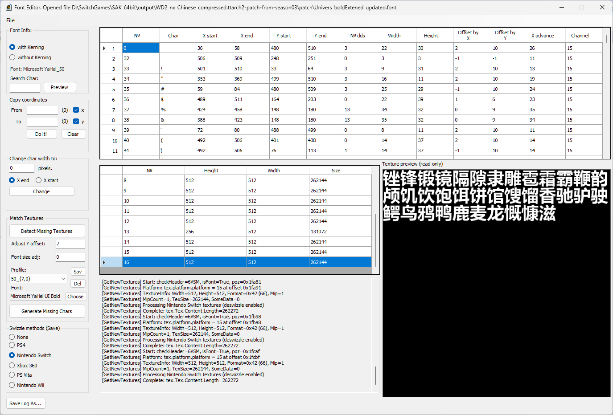

# TTG Tools

A utility for modifying files from Telltale Games, including texts (.landb, .langdb, .dlog, .prop), textures (.d3dtx) for PC, Xbox 360, PS4, PS3, PS Vita, Nintendo Switch, Nintendo Wii, iOS and Android, fonts (.font), as well as extracting and creating archive files (.ttarch, .ttarch2, .obb). Supports decryption of .lua and .lenc files.

Based on [TTG Tools by Den Em and Pashok6798](https://github.com/zenderovpaulo95/TTG-Tools), with additional modifications.

## Recent Changes

### Archive Unpacker Improvements (2026-04)
- **Ttarch2 Scanner**: New tool for scanning ttarch2 archives — browse file listings without full extraction
- **Oodle Kraken Support**: Added detection and decompression for Oodle Kraken (0x8C 0x06) algorithm, previously only LZHLW was supported
- **Last Chunk Padding Detection**: Combined approach — try full chunkSize first (padded archives), fall back to file offset calculation (unpadded archives). Displays padding status in Archive Info panel
- **Archive Info Panel**: Now shows compression algorithm name (Deflate / Oodle LZHLW / Oodle Kraken), TTArch2 version (3ATT/4ATT), and last chunk padding status
- **Cross-Thread Fix**: Fixed InvalidOperationException when extracting files with search filter or format filter enabled
- **Lua Encryption Detection**: Improved — only marks .lenc files as encrypted by default, checks .lua files by reading actual content after decompression

### Font Editor Enhancements (2026)
- **YOffset Batch Adjustment**: Added "FNT Adjust" groupBox with YOffset adjustment controls — apply a delta value (e.g., +3 or -5) to all characters' YOffset at once, instead of per-character
- **Switch Font Compatibility Fix**: Fixed two critical bugs that prevented NewFormat fonts from displaying on Nintendo Switch:
  - **FontName overwrite**: FNT import no longer overwrites an existing FontName — only updates when the name is empty or the default `NewFont`. Prevents glyph block misalignment caused by name length mismatch.
  - **Header offset 0x08**: Always written as `0` (structural separator). Was incorrectly written as the real texture count, corrupting the file header and causing Switch to reject the font.
- **New Font Workflow**: `New → Import FNT → Import DDS → Save` now produces a fully compatible NewFormat font for Nintendo Switch (platform=15, BC3/DXT5, multi-page supported)
  - **Switch Hardware Layout Block**: `EnsureNewTextureHeaderDefaults()` now injects the 60-byte hardware texture parameter block (`tex.block`) when it is uninitialized. Without this block, the game crashes with colorful texture artifacts because the Switch GPU cannot parse the texture memory layout. The template is derived from official Switch fonts and contains tile mode, format, and memory layout parameters required by the hardware decoder.
- **UI Optimization**: Improved user interface with better layout and usability
- **Font Detection**: Added automatic font detection capability for easier file handling
- **Missing Character Generation**: Implemented automatic generation of missing characters for comprehensive font support
- **Texture Management**: Enhanced DDS texture file handling with automatic copying during save operations
- **Multi-page Support**: Improved support for fonts with multiple texture pages
- **Default Font Fix**: Set default font to Tahoma to prevent layout issues on non-English systems
- **Profile System**: Save/load Y offset, Font Size adj, font family, font style, and font file path settings
- **Font Picker Dialog**: Redesigned as a VS-designable Form — supports system font search filter, style selection (Regular/Bold/Italic/BoldItalic), and TTF/OTF file browsing
- **CJK Font Fallback**: Font picker automatically uses a CJK-capable font (Microsoft YaHei, Yu Gothic, Meiryo, etc.) for correct display of all font names on any locale
- **Smart Gap-Filling**: Detects empty slots on the last texture page via FNT table lookup + pixel verification, fills them before creating new pages
- **Regeneration**: Re-generate with different settings (Y offset, font size) by reusing the same page positions and restoring original page data

### Archive Packer Improvements (2026)
- **Padding Control**: Added option to control last chunk padding (compatible mode pads to full chunk size)
- **Oodle Compression**: Corrected function signature (10 parameters + StdCall) for OodleLZ_Compress
- **Header Accuracy**: Fixed zCTT header field ordering and chunksFirstOffset calculation for Oodle compressed archives
- **Kraken Buffer Overflow Fix**: Fixed delayed AccessViolation crash when compressing large dense binary files (.font, .d3dtx) with Oodle Kraken — output buffer now includes extra padding to prevent native heap corruption

### Text Normalization Improvements (2026)
- **Remove blanks between CJK characters**: Added an AutoPacker option to remove unnecessary spacing between CJK characters during import, preserving natural CJK text flow.
- **Dot-to-Chinese-period replacement**: Added support for converting ASCII dots near CJK text into full-width Chinese periods during import, improving punctuation consistency in localized dialogue.
- **Newline punctuation normalization**: Added AutoPacker Text Normal option to normalize punctuation before explicit `\n` markers during import, preventing malformed line breaks like `\n。` and preserving proper sentence structure. This option is enabled by default.
## Screenshots

### Archive Unpacker

### Archive Packer

### Font Editor

## Features

TTG Tools makes it easier to translate and modify Telltale Games and Skunkape Games. It currently supports:

- Telltale Texas Hold'em
- Bone: Out from Boneville / The Great Cow Race
- Sam & Max: Save the World / Beyond Time and Space / The Devil's Playhouse
- Sam & Max: Save the World - Remastered / Beyond Time and Space - Remastered / The Devil's Playhouse - Remastered
- Strong Bad's Cool Game for Attractive People
- Wallace & Gromit's Grand Adventures
- Tales of Monkey Island
- Hector: Badge of Carnage
- Puzzle Agent 1 & 2
- Poker Night at the Inventory / Poker Night 2
- Poker Night at the Inventory - Remastered
- Back to the Future: The Game
- Jurassic Park: The Game
- Law & Order: Legacies
- The Walking Dead: Season One / Season Two / A New Frontier / The Final Season / The Telltale Definitive Series / Michonne
- The Wolf Among Us
- Tales from the Borderlands (2015 & 2021)
- Game of Thrones: The Telltale Series
- Minecraft: Story Mode - Season One / Season Two
- Batman: The Telltale Series / The Enemy Within
- Marvel's Guardians of the Galaxy: The Telltale Series

## Special Thanks

- Den Em and Pashok6798 for the original TTG Tools
- Aluigi for the source code of `ttarchext`
- Taylor Hornby for the C# source code of Blowfish encryption
- Gdkchan, Stella/AboodXD for the Nintendo Switch swizzle method
- Daemon1 and tge for the PS4 swizzle algorithm
- Josh Tamely for the Oodle wrapper
- Hajin Jang for the Zlib wrapper
- [Nemiroff](https://github.com/Nemiroff/TTG-Tools) for fixing a bug in the Font Editor
- Krisp for adding Xbox and Wii textures support and font editing with Swizzle
- [Benny](https://quickandeasysoftware.net) for sending the encryption key for Poker Night at the Inventory - Remastered
